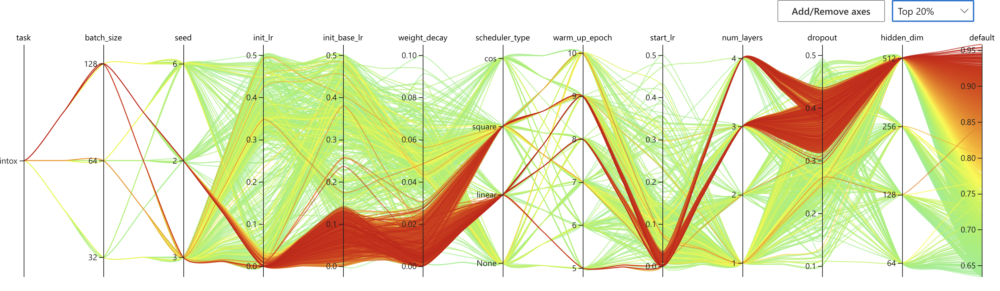

# SCAGE

## What is SCAGE?

SCAGE is a self-conformation-aware pre-training framework for molecular property prediction reveals the quantitate structure-activity relationship like human experts

## Some command lines

You can directly use the following command lines to run the code in bash script.

```bash
CUDA_VISIBLE_DEVICES=1 nohup python pretrain.py > ./pretrain_log/pretrain1.log 2>&1 &
```

### 0. Fix some bugs

```bash
export LD_LIBRARY_PATH="/home2/s439850/anaconda3/envs/SAGE/lib:$LD_LIBRARY_PATH"
```

```bash
export LD_LIBRARY_PATH="/home2/s439850/anaconda3/envs/SAGEHH/lib:$LD_LIBRARY_PATH"
```

### 1. Pre-training

```bash
CUDA_VISIBLE_DEVICES=3 python pretrain.py
```

```bash
python -m torch.distributed.launch --nproc_per_node=4 pretrain_dis.py
```

### 2. Fine-tuning

```bash
unset http_proxy
unset https_proxy
```

```bash
nnictl create --config ./config.yaml -p 3325
```

## experimental results

[tencent document link](https://docs.qq.com/sheet/DVnVEYk96b0p5WkVR?tab=000001)

close nni and then view it again

```bash
nnictl stop --port 3329
nnictl stop -a
```

```bash
nnictl view omFiEsra --port 3328 -e /archive/bioinformatics/Zhou_lab/shared/jjin/SCAGE/log
```

### 1. fintune on no pretrain



<details>
<summary>some other results</summary>
<p>


</p>
 </details>

